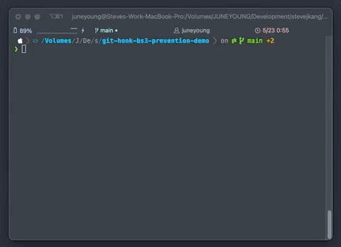

# git-hook-bs3-prevention

  Git pre-commit hook script to prevent using bootstrap-3 classes which deprecated in bootstrap-4 in .pug files.

  

## Demo

## Usage

    $ git clone https://github.com/stevejkang/git-hook-bs3-prevention.git && cd git-hook-bs3-prevention
    $ cp pre-commit ../<your project path>/.git/hooks/
    $ chmod +x ./.git/hooks/pre-commit

## License

  MIT

## Author

  stevejkang <iam@juneyoung.io>
